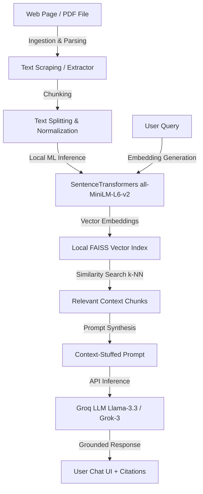

# 🤖 AI Website Chatbot & Browser Extension (RAG-Powered)

An embeddable, data-grounded AI chatbot widget and browser companion built on a local **Retrieval-Augmented Generation (RAG)** pipeline. Instead of relying on generic pre-trained LLM responses, this system extracts real-time page content or PDF data, generates dense vector representations locally using a SentenceTransformers model, indexes them in a local FAISS vector store, and synthesizes context-grounded responses using Groq's LLM inference engine.

---

## 🌟 What is this Project?

This project is a full-stack RAG (Retrieval-Augmented Generation) application designed for two main interfaces:
1. **Floating Web Widget:** A lightweight, embeddable React chatbot that website owners can integrate into any page using a single script tag.
2. **Browser Extension:** A Manifest V3 companion extension (compatible with Chrome, Edge, Brave, etc.) that parses the active browser tab on-demand so you can chat with any webpage you are currently viewing.

---

## 🧠 System Architecture & RAG Pipeline



### 1. Data Ingestion & Preprocessing
* **HTML Parsing:** Leverages BeautifulSoup4 to scrape raw HTML, strip boilerplates (scripts, styles, navigation bars), and extract clean semantic text from webpages.
* **Document Processing:** Uses PyMuPDF (fitz) to parse and clean text layouts from uploaded PDFs.
* **Chunking Strategy:** Implements a recursive character text splitter to divide text into overlapping chunks, preserving semantic context across chunk boundaries.

### 2. Local Machine Learning Pipeline (Embeddings)
* **Model:** HuggingFace `all-MiniLM-L6-v2` run locally via SentenceTransformers.
* **Dimensionality:** Maps text chunks into a 384-dimensional dense vector space.
* **Benefit:** Zero external API calls for embedding generation, preserving privacy and keeping local processing fast and CPU-friendly.

### 3. Vector Storage & Nearest Neighbor Search
* **Database:** FAISS (Facebook AI Similarity Search) index.
* **Matching:** Computes cosine similarity (or L2 distance) between the vector representation of the user's query and the indexed text chunks to retrieve the top $K$ most relevant context segments.
* **Persistence:** Serializes and loads the FAISS index (`index.faiss`) and chunk metadata (`chunks.pkl`) locally inside `backend/vector_store/`.

### 4. Retrieval-Augmented Generation (LLM Inference)
* **Prompt Assembly:** Combines the user query with the retrieved context blocks, injecting strict instructions to prevent hallucination.
* **LLM Engine:** Groq API Client hosting high-throughput open weights models (e.g., `llama-3.3-70b-versatile` or `grok-3`).
* **Output:** Generates accurate, context-bound answers including inline citations pointing back to the specific source paragraphs or page sections.

---

## 💡 Where Can We Use It? (Use Cases)

- **Customer Support Agent:** Embed the chat widget on an e-commerce or SaaS website, pointing it to your FAQ or documentation page to answer customer questions automatically.
- **Interactive PDF Reader:** Upload company brochures, restaurant menus, product manuals, or research papers to the dashboard to instantly query and extract information.
- **Web Research Companion:** Use the browser extension on long articles, news reports, or document tabs to get quick answers and summaries without reading the entire page or copy-pasting text.
- **Local Dev Sandbox:** Run a fully local semantic search system on your machine with zero cloud database hosting costs, utilizing local embeddings and the free, high-performance Groq LLM API.

---

## 🛠️ Technology Stack

| Component | Technology | Description / Role |
|---|---|---|
| **Backend Framework** | Python 3.10+, FastAPI, Uvicorn | High-performance asynchronous API endpoints for document ingestion and chat. |
| **Vector Indexing** | LangChain, FAISS (Facebook AI Similarity Search) | Local vector clustering and rapid similarity queries. |
| **Embeddings Model** | HuggingFace `all-MiniLM-L6-v2` | CPU-optimized local transformer model for generating 384-dimensional text embeddings. |
| **LLM Inference** | Groq API Client | Cloud LLM execution (`llama-3.3-70b-versatile` or `grok-3`) with low-latency inference. |
| **Parsing & Scraping** | BeautifulSoup4, PyMuPDF (fitz), Requests | Extracts raw textual data from web URLs and PDF document pages. |
| **Frontend UI** | React 18, Vite, Vanilla CSS | Interactive dashboard interface for source ingestion and embedding chatbot preview widget. |
| **Browser Extension** | Manifest V3, HTML5, JavaScript, Vanilla CSS | Companion utility to parse current browser tabs and chat directly with them. |

---

## 📂 Project Structure

```
WebWidget/
├── backend/                  # FastAPI App & Python services
│   ├── routes/               # Ingest (URL/PDF) & Chat endpoints
│   ├── services/             # Scraper, PDF parser, FAISS embedder, RAG chain
│   └── vector_store/         # Autocreated folder for FAISS files (index.faiss, chunks.pkl)
├── extension/                # Manifest V3 browser companion popup UI & logic
├── frontend/                 # React frontend landing & chat widget
└── demo/                     # Client embed simulation page
```

---

## ⚡ How to Run the Project (Step-by-Step)

To run the full project locally, you will need to open **two separate terminal windows** (one for the backend server and one for the frontend server).

### Terminal 1: Start the Backend (FastAPI Server)
1. Open a new terminal window.
2. Navigate to the `backend` folder:
   ```bash
   cd backend
   ```
3. Create a Python virtual environment and activate it:
   - **Windows:**
     ```bash
     python -m venv venv
     .\venv\Scripts\activate
     ```

4. Install the backend Python libraries:
   ```bash
   pip install -r requirements.txt
   ```
5. Ensure a `.env` file exists inside the `backend/` directory with your Groq API Key:
   ```env
   GROK_API_KEY=your_actual_groq_api_key
   GROK_BASE_URL=https://api.groq.com/openai/v1
   GROK_MODEL=llama-3.3-70b-versatile
   ```
6. Start the backend API server:
   ```bash
   uvicorn main:app --reload --port 8000
   ```
   *The backend will now be running on `http://localhost:8000`.*

---

### Terminal 2: Start the Frontend (Vite/React Dashboard)
1. Open a **second, separate** terminal window.
2. Navigate to the `frontend` folder:
   ```bash
   cd frontend
   ```
3. Install the frontend dependencies (only required the first time):
   ```bash
   npm install
   ```
4. Run the frontend development server:
   ```bash
   npm run dev
   ```
5. Open your browser and navigate to:
   ```
   http://localhost:5173
   ```
   *This loads the dashboard landing page. You can click the chat bubble in the bottom right corner to test the widget.*

---

### Browser Setup: Load the Chrome/Edge Extension
1. Open Google Chrome, Microsoft Edge, or any Chromium-based browser.
2. Navigate to your extensions page:
   - Chrome: `chrome://extensions/`
   - Edge: `edge://extensions/`
3. Toggle on **"Developer Mode"** (typically a switch in the top-right corner).
4. Click the **"Load unpacked"** button in the top-left corner.
5. In the file select dialogue, navigate to your project directory and choose the `extension` folder.
6. The extension is now active! To use it:
   - Open any public webpage (e.g., an article, Wikipedia page, blog post).
   - Click the extension icon in your browser toolbar.
   - Click the **"Analyze & Train AI on Page"** button.
   - Once processed, you can type your questions in the input bar and chat with the page contents!
